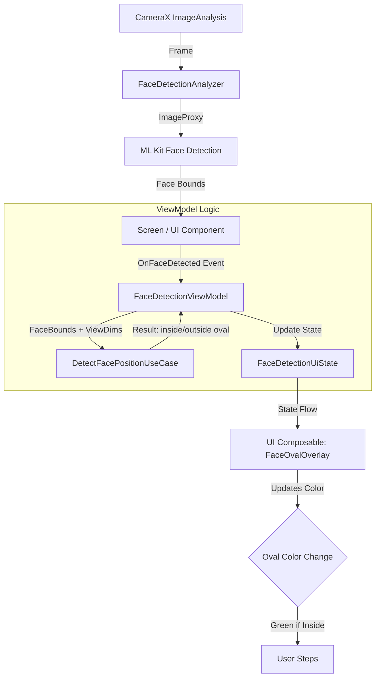
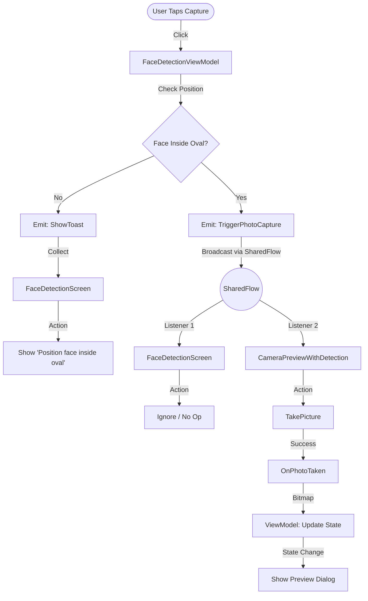

# Face Detection Camera App

An Android application that captures photos with real-time face position verification using ML Kit Face Detection API.

## 📦 Demo & Download

https://github.com/user-attachments/assets/4d27d15f-0554-450f-8701-48e58f9aebb2

- **APK Download**: [GitHub Releases](https://github.com/bhaskar966/Face-Detector)

***

## 📖 Overview

This Android application demonstrates a comprehensive implementation of face detection with camera integration, utilising modern Android development practices. The app captures photos only when a user's face is correctly positioned within an on-screen oval guide, providing real-time visual feedback.

### Key Features

- ✅ Real-time face detection using Google ML Kit
- ✅ Visual feedback with color-coded oval (Neutral/Red/Green)
- ✅ Photo capture only when the face is properly positioned
- ✅ Front/back camera switching
- ✅ Photo preview with confirm/retake options
- ✅ In-memory image storage (no persistence)
- ✅ Clean Architecture with MVVM pattern

***

## 🏗️ Architecture & Implementation

### Architecture Pattern: Clean Architecture + MVVM + UDF

The app follows Clean Architecture principles with clear separation of concerns:

```
┌─────────────────────────────────────────────────────┐
│                  Presentation Layer                 │
│  ├─ UI (Composables)                                │
│  ├─ ViewModel (State Management)                    │
│  ├─ State (UI State)                                │
│  └─ Events (User Actions & Side Effects)            │
└─────────────────────────────────────────────────────┘
                        ↓
┌─────────────────────────────────────────────────────┐
│                   Domain Layer                      │
│  └─ UseCase (Business Logic)                        │
└─────────────────────────────────────────────────────┘
```

### Unidirectional Data Flow (UDF)

- **State flows DOWN**: ViewModel → UI (via StateFlow)
- **Events flow UP**: UI → ViewModel (via event handlers)
- **Side Effects**: One-time events handled via SharedFlow (Toasts, Navigation)

### Tech Stack

**Core Technologies:**
- **Language**: Kotlin 100%
- **UI**: Jetpack Compose
- **Architecture**: MVVM + Clean Architecture
- **Navigation**: Type-safe Navigation Compose with Kotlin Serialization
- **Dependency Injection**: Manual (ViewModel Factory pattern)

**Camera & ML:**
- **CameraX**: 1.5.3 (with Compose integration)
- **ML Kit Face Detection**: 16.1.7
- **CameraXViewfinder**: Native Compose camera preview (no AndroidView)

**Async & State:**
- **Coroutines**: Flow, StateFlow, SharedFlow
- **Lifecycle**: ViewModel, Lifecycle-aware components

***

## 🔧 How It Works

### 1. Face Detection Pipeline



**Key Components:**

- **DetectFacePositionUseCase**: Pure business logic that:
  - Transforms face bounding box from camera image coordinates to screen coordinates
  - Uses ellipse equation `(x-cx)²/rx² + (y-cy)²/ry² <= 0.9` to check if face center is inside oval
  - Returns `FaceDetectionResult` with position status

- **FaceDetectionViewModel**: Manages UI state and coordinates:
  - Stores current face detection result separately (`currentFaceResult`) to avoid timing issues
  - Validates face position before allowing capture
  - Handles camera state, errors, and photo processing

- **CameraPreviewWithDetection**: Integrates three CameraX use cases:
  - **Preview**: Displays camera feed using `CameraXViewfinder`
  - **ImageAnalysis**: Processes frames for face detection (FAST mode, 15% min face size)
  - **ImageCapture**: Captures photos when triggered

### 2. Photo Capture Flow



### 3. Coordinate Transformation

**Challenge**: Camera image dimensions ≠ Screen dimensions

**Solution**: Scale transformation
```kotlin
val scaleX = viewWidth.toFloat() / imageWidth
val scaleY = viewHeight.toFloat() / imageHeight

transformedBox = Rect(
    (box.left * scaleX).toInt(),
    (box.top * scaleY).toInt(),
    (box.right * scaleX).toInt(),
    (box.bottom * scaleY).toInt()
)
```

This ensures the face bounding box aligns perfectly with the on-screen oval.

### 4. Oval Sizing Logic

The oval size is calculated based on the **smaller screen dimension** to prevent stretching:

```kotlin
val minDimension = minOf(screenWidth, screenHeight)
val ovalWidth = minDimension * 0.60f  // 60% of smaller dimension
val ovalHeight = minDimension * 0.80f // 80% of smaller dimension
```

This ensures proper proportions on all device sizes and orientations.

***

## 🚀 Setup Guide

### Prerequisites

- Android Studio Hedgehog (2023.1.1) or later
- JDK 17
- Android SDK API 24+ (target: API 34)
- Physical device or emulator with camera

### Installation Steps

1. **Clone the repository**
   ```bash
   git clone https://github.com/bhaskar966/Face-Detector
   cd face-detection-app
   ```

2. **Open in Android Studio**
   - Open Android Studio
   - Select "Open an Existing Project"
   - Navigate to the cloned directory

3. **Sync Gradle**
   - Wait for Gradle sync to complete
   - Ensure all dependencies are downloaded

4. **Run the app**
   ```bash
   ./gradlew installDebug
   ```
   Or use the Run button in Android Studio

***

## 📱 Usage

1. **Grant Camera Permission**: On first launch, grant camera permission when prompted
2. **Main Screen**: Click "Open Camera" to start face detection
3. **Position Your Face**: Align your face inside the oval guide
   - **Gray oval**: No face detected
   - **Red oval**: Face detected but not aligned
   - **Green oval**: Face perfectly aligned
4. **Capture Photo**: Click the capture button (only works when the oval is green)
5. **Preview**: Review the captured photo
   - Click ✓ to confirm and return to the main screen
   - Click ↻ to retake
6. **Delete Photo**: On the main screen, click the trash icon to delete the captured photo

***

## 🎯 Key Implementation Decisions

### Why Clean Architecture?
- **Testability**: Business logic isolated in UseCases (no Android dependencies)
- **Maintainability**: Clear separation between UI, business logic, and data layers
- **Scalability**: Easy to add new features without touching existing code

### Why UDF Pattern?
- **Predictability**: All state changes happen through events
- **Debugging**: Easy to track state changes in one place
- **Testing**: Mock ViewModels, emit events, assert state changes

### Why Type-Safe Navigation?
- **Compile-time safety**: Typos caught at compile time, not runtime
- **Refactoring**: Rename routes automatically updates all usages
- **Modern approach**: Latest Navigation Compose best practices

### Why In-Memory Storage?
- **Simplicity**: No file I/O, no storage permissions needed
- **Performance**: Bitmap stays in memory, instant display

### Why Channel for Side Effects?
- **One-time events**: Toasts and navigation shouldn't be in state (would retrigger on rotation)
- **Guaranteed delivery**: SharedFlow ensures events are consumed once
- **Clean separation**: State = persistent, Effects = ephemeral
***

## 🐛 Known Issues & Limitations

- **Image not persisted**: Captured image is lost when the app is killed (by design)
- **Single face detection**: Only detects the first face found
- **Performance on low-end devices**: Face detection may lag on older devices
- **Portrait orientation**: App works best in portrait mode

***

## 👤 Author

**Your Name**
- GitHub: [@bhaskar966](https://github.com/bhaskar966/)

***

**Built with ❤️ using Kotlin & Jetpack Compose**
